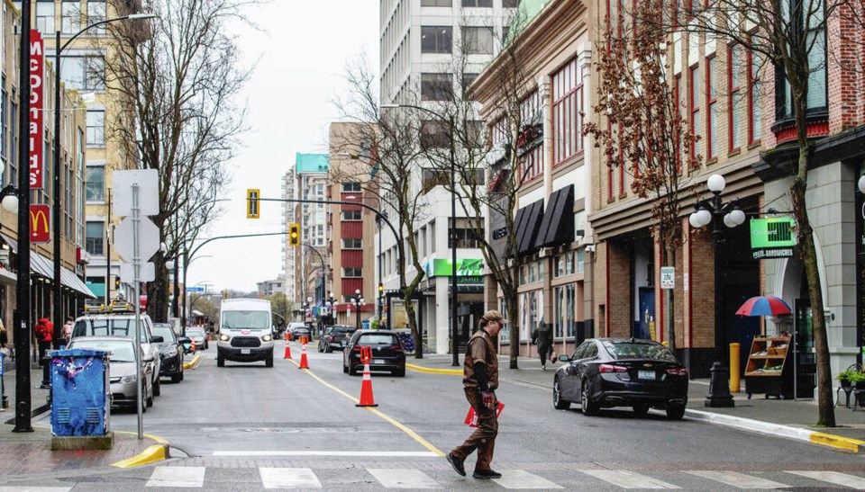
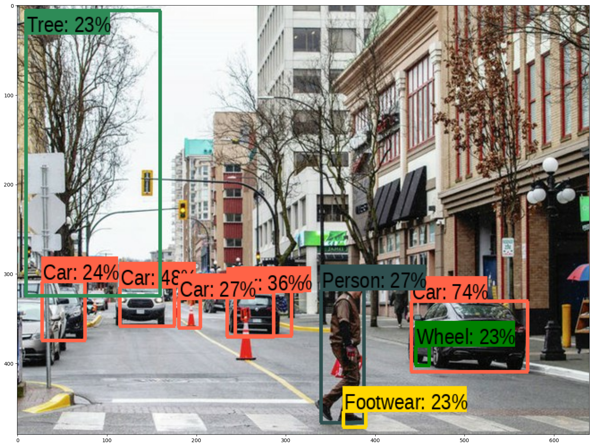

# Predicting Bounding Boxes for Object Detection

In this repository we use tensorflow hub pretrained modules to detect objects in images and draw bounding boxes around the detected objects using the oputpus.

## Table of Contents

- [Introduction](#introduction)
- [Deep Learning Architectures for Computer Vision Tasks](#deep-learning-architectures-for-computer-vision-tasks)
- [Tensorflow Hub](#tensorflow-hub)
- [Select and load the model](#select-and-load-the-model)
- [Getting Started](#getting-started)
- [Contributing](#contributing)
- [License](#license)

## Introduction

Object detection is a computer vision technique that involves identifying and localizing objects within an image or video. The goal is to not only classify the objects present in the scene but also determine their precise locations by drawing bounding boxes around them, and a number that shows the model's level of certainty about the predicted class.

| Image 1                                      | Image 2                                      |
| -------------------------------------------  | -------------------------------------------- |
|                 |             |

Object detection using pretrained modules refers to the process of utilizing pre-trained models that have already been trained on large datasets for object detection tasks. These pre-trained models are trained on a vast amount of labeled images and have learned to recognize and classify various objects within the images.

By using pretrained modules, you can benefit from the knowledge and features extracted from the large dataset on which the models were trained. This saves you from having to train a model from scratch, which can be time-consuming and computationally expensive.

## Deep Learning Architectures for Computer Vision Tasks

There are several popular deep learning architectures that have been widely used in computer vision tasks. Here are some notable ones:

- **Convolutional Neural Networks (CNN):** CNNs are foundational architectures for computer vision tasks. They use convolutional layers to automatically learn local patterns and spatial hierarchies in images. Popular CNN architectures include AlexNet, VGGNet, GoogLeNet (Inception), ResNet, and DenseNet.

- **Region-based Convolutional Neural Networks (R-CNN):** R-CNN and its variants, such as Fast R-CNN, Faster R-CNN, and Mask R-CNN, are widely used for object detection and instance segmentation tasks. They combine region proposal mechanisms with CNNs to accurately localize and classify objects in images.

- **YOLO (You Only Look Once):** YOLO is a real-time object detection architecture that directly predicts bounding box coordinates and class probabilities in a single pass. YOLO versions include YOLOv1, YOLOv2, YOLOv3, and YOLOv4. They provide a good balance between accuracy and speed for object detection.

- **SSD (Single Shot MultiBox Detector):** SSD is an object detection architecture that combines object localization and classification into a single unified network. It predicts object bounding boxes and class probabilities directly from feature maps generated by a base network. SSD achieves real-time object detection by using a set of predefined anchor boxes at multiple scales and aspect ratios. It is known for its simplicity and efficiency, making it suitable for applications that require fast and accurate object detection.

- **MobileNet:** MobileNet is designed for efficient inference on mobile and embedded devices with limited computational resources. It utilizes depthwise separable convolutions to reduce the number of parameters and computations while maintaining reasonable accuracy. MobileNet versions include MobileNetV1, MobileNetV2, and MobileNetV3.

- **ResNet (Residual Neural Network):** ResNet introduced residual connections to address the challenge of training very deep neural networks. ResNet architectures, such as ResNet-50, ResNet-101, and ResNet-152, have achieved state-of-the-art performance in various computer vision tasks, including image classification, object detection, and semantic segmentation.

- **InceptionNet (GoogleNet):** InceptionNet, also known as GoogLeNet, introduced the concept of inception modules with multiple parallel convolutional operations. It enables efficient use of computational resources and captures features at different scales. InceptionNet versions include InceptionV1, InceptionV2, InceptionV3, and InceptionV4.

- **U-Net:** U-Net is a popular architecture for image segmentation tasks. It consists of an encoder-decoder structure with skip connections that help preserve spatial information at different resolutions. U-Net is widely used in medical image analysis and other segmentation applications.

Each architecture has its own strengths and applications, depending on the specific task requirements, dataset characteristics, and available computational resources. 

## Tensorflow Hub

TensorFlow Hub is a repository and platform that enables the sharing, discovery, and reusability of machine learning models and resources. It serves as a central hub for hosting pre-trained models, embeddings, and various other resources that can be used in TensorFlow-based projects.

## Select and load the model

You can choose an object detection module. Here are two that I've selected for you in the notebook:
* [ssd + mobilenet V2](https://tfhub.dev/tensorflow/ssd_mobilenet_v2/2) small and fast.
* [FasterRCNN + InceptionResNet V2](https://tfhub.dev/google/faster_rcnn/openimages_v4/inception_resnet_v2/1): high accuracy

## Getting Started

To get started with this project, follow these steps:

1. Click this link to open the notebook in Colab: https://colab.research.google.com/github/barzansaeedpour/predicting_bounding-boxes_for_object_detection/blob/main/predicting_bounding-boxes_for_object_detection.ipynb

2. The instruction and explaination of the code is mentioned in the notebook

## Contributing

Contributions to this repository are welcome. If you find any issues or have suggestions for improvements, feel free to open an issue or submit a pull request.

## License

This project is licensed under the [MIT License](LICENSE). Feel free to use and modify the code as per the terms of the license.